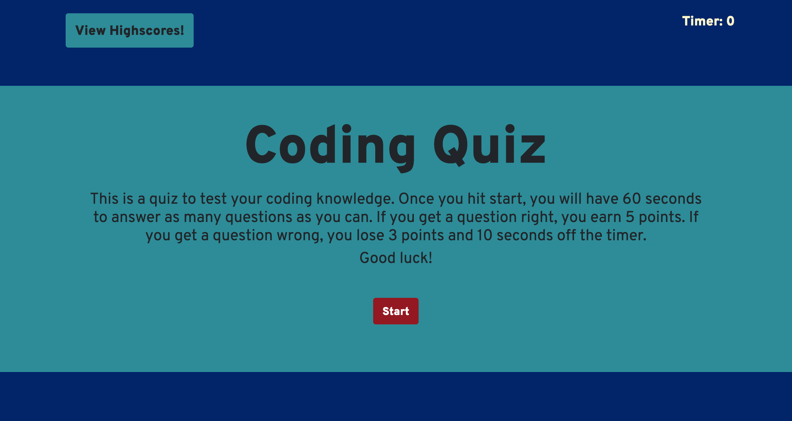
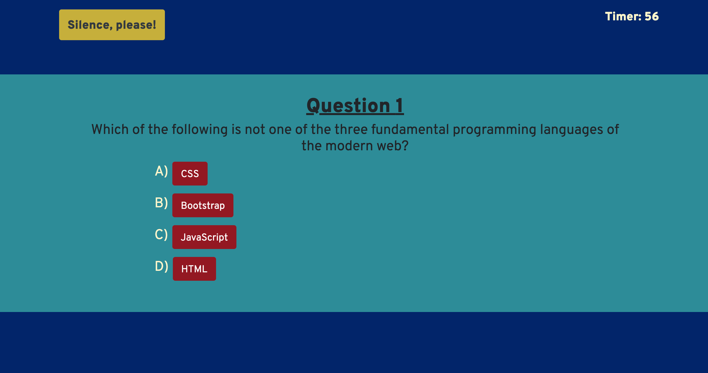
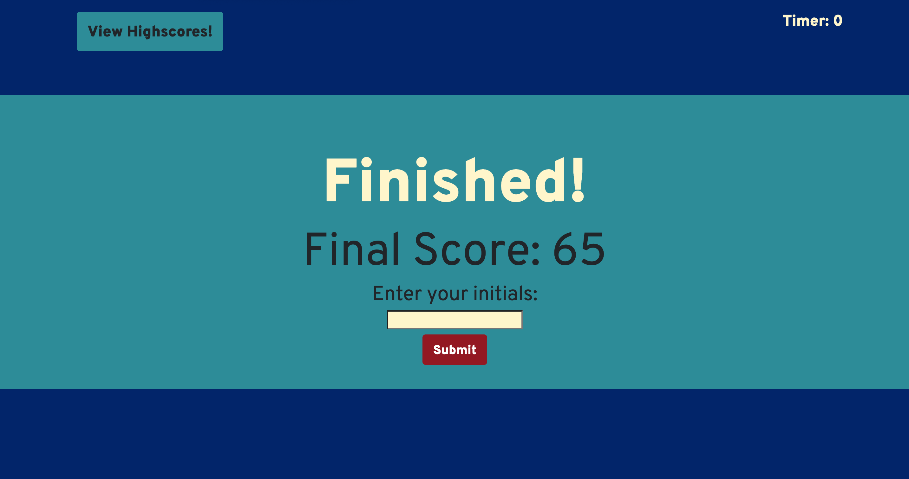
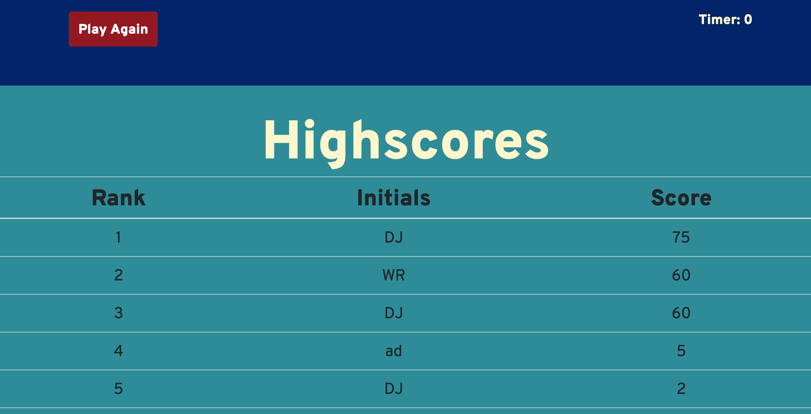

# Coding Quiz

## Description

This is a coding quiz created by me, DJ Hersh, to test the user's knowledge on basic HTML, CSS, and JavaScript. In building this quiz, I utilized many concepts taught to me in the UCLA Extension Full-Stack Web Development Coding Bootcamp by Bryan Swarthout.

One feature of this quiz that I am very proud of is that each time a user takes it, the questions will be in a different order, and each time the user comes across a question, the answer options will be in a different order. I was able to write an algorithm that did this by storing my questions and answers in objects, and put those objects in an array. I then generated a random index of that array, spliced that index out and moved it into a new array, so that I could avoid the same question appearing more than once in a single round of the quiz. I did the same for the answer options. If the user decides to take the quiz again, the answers are reset back into their original question object, and the question objects themselves are reset back into their original array.

I also utilized local storage to hold the data of user's initials and their score. The local storage will hold the 10 highest scores played on a user's device, and display them on the Highscores board.

I used Bootstrap to help make the layout responsive, but also added in some of my own CSS styles to make the quiz page look interesting. I found a great website, Coolors.io, that generates color schemes, and used it to choose colors for this quiz page. I created a favicon using the website favicon.io. I also took the font, Overpass, from Google fonts. The background music is the theme from the popular TV game show, 'Jeopardy'.

This coding quiz can be used in many ways. The most obvious would be to test someone's knowledge of HTML, CSS, and JavaScript. I believe it can also be used by me to show that I have a good understanding of basic JavaScript.

## Table of Contents

* [Link](#link)
* [Usage](#usage)
* [Credits](#credits)
* [License](#license)

## Link

https://dj620.github.io/code-quiz/

## Usage 

When you first get to the page, you will see a message describing the quiz and its rules. The user will have 60 seconds to answer as many questions as they can. If they get an answer right, they gain 5 points. If they get an answer wrong, they lose 3 points, and 10 seconds off of the timer. There will be a button in the top left that will allow you to view the Highscores board, as well as a button at the bottom to start the quiz.

When the user clicks start, the background music will begin to play, and the timer will begin counting down from 60. The 'View Highscores!' button will be replaced with a new button that allows the user to switch off the music if they'd rather take the quiz in silence. Each question will be formatted the same, with four options. If the user chooses the correct answer, the word 'Correct!' will be displayed in the bottom right of the screen. If the user chooses the wrong answer, the word 'Wrong' will be displayed, and the correct answer will change it's background color so the user can identify which of the options was correct. As stated in my description, each time a user takes the quiz, the answer options will be in a different order.

When the user runs out of time, or finishes answering all questions, the music will stop playing (if they didn't turn the music off earlier), and they will be presented with their final score and the option of entering their initials to be displayed on the Highscores board. 

Once the user has submitted their initials, or if at any time the user hits the 'View Highscores' button, they will be taken to the Highscores Board. This page will display up to the 10 highest scores played on that user's device. This data is stored in local storage as an array of objects. The algorithm dynamically creates the objects by setting them to the index of the length of the array.

## Credits

Much of the knowledge I used to creat this code quiz came from the UCLA Extension Full-Stack Web-Development Coding Bootcamp, instructor Bryan Swarthout, and TA Wilson Lam.

http://www.uclaextension.edu

I utilized The CSS framework Bootstrap to style the page and make it responsize.

http://getbootstrap.com

I utilized the website coolors.io to generate a color scheme.

https://coolors.co

I created a favicon on favicon.io

https://favicon.io

I took the font 'Overpass' from Google Fonts

https://fonts.google.com

In addition to what I have learned from my bootcamp, I also learned a great deal from the websites CodeCademy and FreeCodeCamp.

http://www.codecademy.com

http://freecodecamp.com

## License

MIT License

Copyright (c) [2020] [DJ Hersh]

Permission is hereby granted, free of charge, to any person obtaining a copy
of this software and associated documentation files (the "Software"), to deal
in the Software without restriction, including without limitation the rights
to use, copy, modify, merge, publish, distribute, sublicense, and/or sell
copies of the Software, and to permit persons to whom the Software is
furnished to do so, subject to the following conditions:

The above copyright notice and this permission notice shall be included in all
copies or substantial portions of the Software.

THE SOFTWARE IS PROVIDED "AS IS", WITHOUT WARRANTY OF ANY KIND, EXPRESS OR
IMPLIED, INCLUDING BUT NOT LIMITED TO THE WARRANTIES OF MERCHANTABILITY,
FITNESS FOR A PARTICULAR PURPOSE AND NONINFRINGEMENT. IN NO EVENT SHALL THE
AUTHORS OR COPYRIGHT HOLDERS BE LIABLE FOR ANY CLAIM, DAMAGES OR OTHER
LIABILITY, WHETHER IN AN ACTION OF CONTRACT, TORT OR OTHERWISE, ARISING FROM,
OUT OF OR IN CONNECTION WITH THE SOFTWARE OR THE USE OR OTHER DEALINGS IN THE
SOFTWARE.